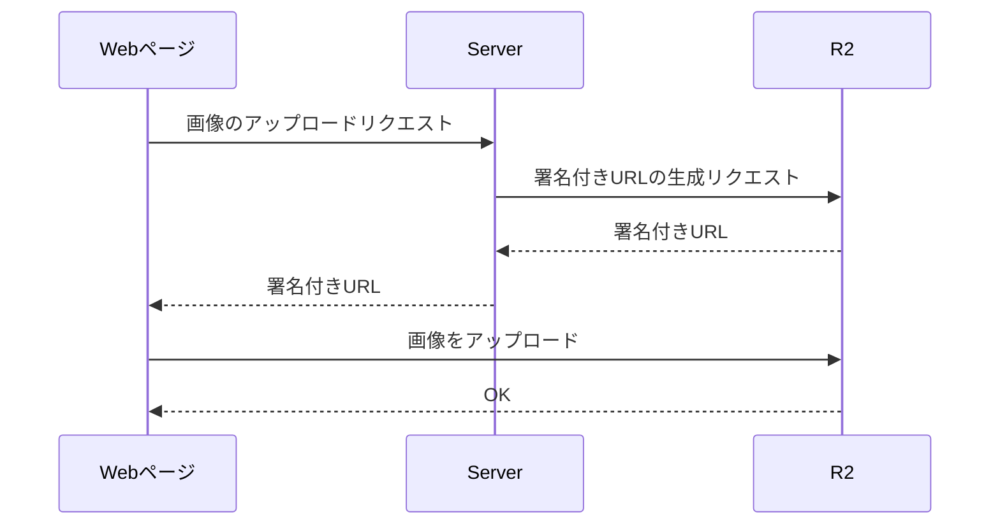
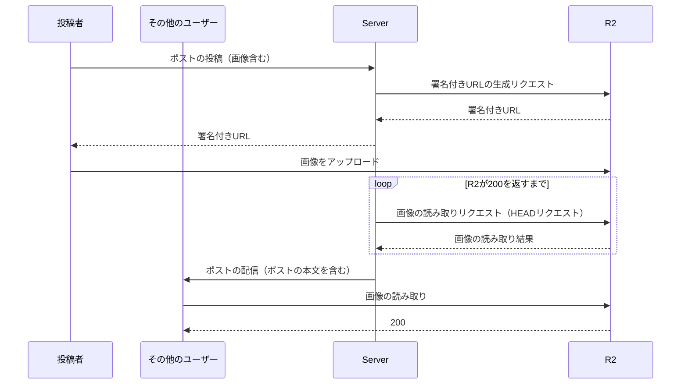

# TL;DR

- Cloudflare R2でアップロードした画像が読み取れるまでに時間がかる問題が発生した（数分レベル）
- 問題の原因は、R2の画像が読み取り可能になるまで少し時間が必要なことと、キャッシュの複合的な要因だった
- 画像が読み取り可能になるまでキャッシュ無視でポーリングして回避した

# はじめに

最近趣味の開発ではCloudflare R2を多用しています。

https://www.cloudflare.com/ja-jp/developer-platform/products/r2/

Cloudflare R2はAWS S3互換を唄っているオブジェクトストレージです。CloudflareはCDNとして有名ですが、最近ではSaaSをいくつもリリースしていて、CDNの大手ならではの強みを活かしてリージョンの設定をフルマネージドにしていたり、料金が破格の安さだったりと、なかなかに野心的なサービスを提供しています。

Cloudflareは今年ログ関係の技術を持った会社を買収したため少しずつ改善はされているのですが、まだログ周りが貧弱と言わざるを得ないのと、やはりAWS, Azure, GCPなどに比べるとサービスの幅が狭いので、業務利用には少し難があるといったところです。なのですが、とにかく料金が安くてリソース配布の考慮も全部丸投げしてしまえるので趣味の開発ではとても強力な武器になっていて、私は最近の開発ではとりあえずCloudflareのサービスを使うかというくらいになっています。

さて、今回の本題ですが、趣味で利用をしている都合上あまりシビアなシチュエーションでの検証をしていなかったため長らく気づかなかったのですが、先日とうとうアップロード直後に画像が読み取れないという問題が発生しました。**問題の原因としては「アップロードした画像が有効になるまでに読み取りに行ったキャッシュが残って読み取り可能になるまでに時間がかかってしまった」というありきたりなもの**なので、要素要素としては詳しい解説をしてくれている記事の枚挙に暇がないのですが、CloudflareのSaaSに関しての情報はまだまだ少なく、Cloudflare R2の事情を含めた理解に少し手間取ったので深い知識同士の間を埋めるような記録を残しておこうかと思います。

# 問題の発生

問題は趣味で開発していたWebアプリケーションで発生しました。アプリの内容としてはTwitterやmastodonのようなSNSとなっています。
ポストのテキストはRDBに保存していて、ポストに紐付けられた画像はオブジェクトストレージへアップロードしています。バケットはパブリックになっていて、リードは制限なし、アップロードは署名付きURLからのみとなっています。（前述の通りR2はS3互換で、概念的にはS3と全く同じになっています。）
となっていて、R2の用途はポストに紐付けられた画像の保存先としての利用です。ざっくりと以下のような流れで画像のアップロードそしていました。よくあるような構成ですね。



問題は、それまでページのリロードでのみ行われていた新規ポストの取得をサーバーからのプッシュでリアルタイムに配信し、読み取りをさせるようにしたことをきっかけとして発生しました。ポストの本体はアプリ側で保存しているため、サーバーからのプッシュに情報を含めていたのですが、画像自体はサーバーの処理を簡易化するためにR2に取りに行ってもらうことにしていました。（Cloudflareを利用しているので、R2バケットの設定時にCloudflare上でDNSレコードを設定していて、CDNが効くようになっているため負荷的にも問題ありません）

# 問題の原因

原因の推測・特定作業については長々と書いても仕方ないので割愛し、実際に何が問題となっていたかだけを記載します。

- R2はアップロードされたあと、読み取り可能になるまで少しラグがある
    - Cloudflare側ではファイルがアップロードされると、あちこちのエッジにファイルをレプリケートするようです。
    - レプリケートが完了すると読み取りが可能となるため、アップロード完了から読み取り加納になるまでは少し時間がかかるということです。
- R2に読み取りをするとCDNがキャッシュし、その結果はデフォルトで3分間キャッシュされる
    - 初回の読み取りに失敗するとその結果が最大で3分間キャッシュされるため、キャッシュが切れるまで読み取りは成功しなくなります。

これらが複合的に絡み合った結果、

1. ポストが投稿される（画像がアップロードされる）
2. ポストが配信される
3. クライアントが画像を読み取りに行く（404がCDNにキャッシュされる）
4. R2側のレプリケートが完了する

という順序で処理されると、キャッシュが切れるまで読み取り可能となるまで3分間待たなければならなくなってしまいました。
（実際には2・3と4の処理の順序が保証されないため、確率的に問題は発生していました）

# 解決案

問題の解決案としては以下が考えられました。

- キャッシュを無効化する
    - CDNを設置する意味・・・
- キャッシュを無視してポーリングし、読み取り可能になるまでポストの配信を遅延させる
- アップロード完了をトリガとしてworkersを使って、読み取り可能を通知する or キャッシュを削除する
    - （workersはAWSだとlambdaに相当するサービスです）
- (Imagesを使う)
    - Cloudflareには画像の配信に特化したサービスがあるのですが、まだ調査が出来ておらず解決案になりうるのか不明なのであくまで可能性として書いておきます。


今回はキャッシュを無視してポーリングし、読み取り可能になるまでポストの配信を遅延させる方法を採用しました。
シンプルに解決するにはworkersを使うほうが直感的ですが、後々別の理由からもImagesへ移行することを視野に入れているため、処理が流用しやすそうだったのであえてこの方法を選択しました。

# 解決方法

ポーリングを行う場合のシーケンスとしては以下でした。



serverからのポーリングは、そのままリクエストするとCDNでレスポンスされてしまうのと負荷が大きくなるので、いくつか工夫をしていきます。

### 工夫1: キャッシュを無効化するためクエリパラメータとしてタイムスタンプを付与する

ポーリングをする上で一番問題となるのがキャッシュを利用したレスポンスです。キャッシュを無効化すればポーリングのタイミングでは都合が良いですが、画像が読み取り可能になったあとは複数のクライアントからのリクエストがあるたびにR2にリクエストを送ることになってしまいます。そのため、クエリパラメータにタイムスタンプを付与することで別のリクエストとして扱わせ、CDNのキャッシュを回避させます。
これにより何か特別な処理をworkersで入れていない限りはCDNのキャッシュを使ったレスポンスを回避することが出来ます。

### 工夫2: HEADリクエストを利用する

ポーリングはserverから行うため、画像そのものを読み取る必要はありません。そのため、HEADリクエストを利用して画像本体ではなくヘッダ情報のみの読み取りに絞ることで負荷を抑えていきます。（1件だけであれば大した差分ではないですが、多数のリクエストが並列した場合に負荷が大きくなっていくので、不要な負荷をかけないようにしておきます）

これらの工夫を踏まえたコードのサンプルが以下です。

```elixir:client.exs
cache_avoiding_url = "#{public_url}?timestamp=#{System.system_time(:millisecond)}"

Req.new()
|> Req.head(url: cache_avoiding_url)
|> case do
    {:ok, %Req.Response{status: 200}} -> :ok
    _ -> :error
end
```

プロジェクトのコードをそのまま持ってきたのでelixirでReqというライブラリを使って書いているため馴染みのない方もいるかもしれませんが、やっていることとしてはURLにミリ秒オーダーのタイムスタンプを付与してHEADリクエストを送って、帰ってきたHTTPレスポンスステータスが200かどうかを確認しています。
これを200が帰ってくるまで定期的に呼び続けます。

# まとめ

今回はR2でアップロードした画像が読み取れるまでに時間がかかる問題について、その原因と解決方法を記載しました。原因と解決法については一般的な問題の組み合わせなのですが、いかんせんR2の情報が少ないことで調査と解決に時間がかかってしまったので、今後のためにも記録として残しておきます。
同じような問題に悩んでいる方の一助となれれば嬉しいです。

Cloudflareのサービス自体はとても使いやすく、強力な機能・サービスが用意されていて、どんどん新しいサービスが追加されているので今後に期待ですね！
